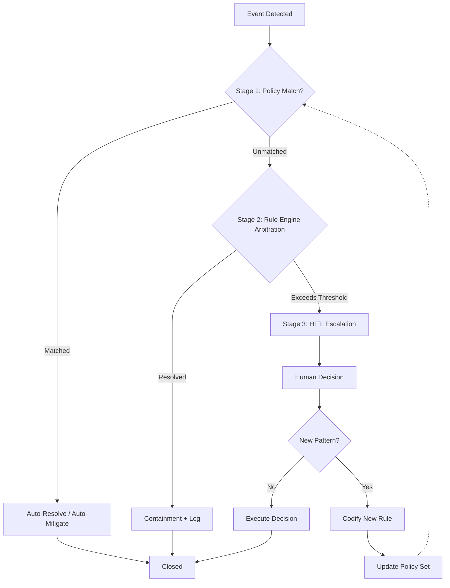
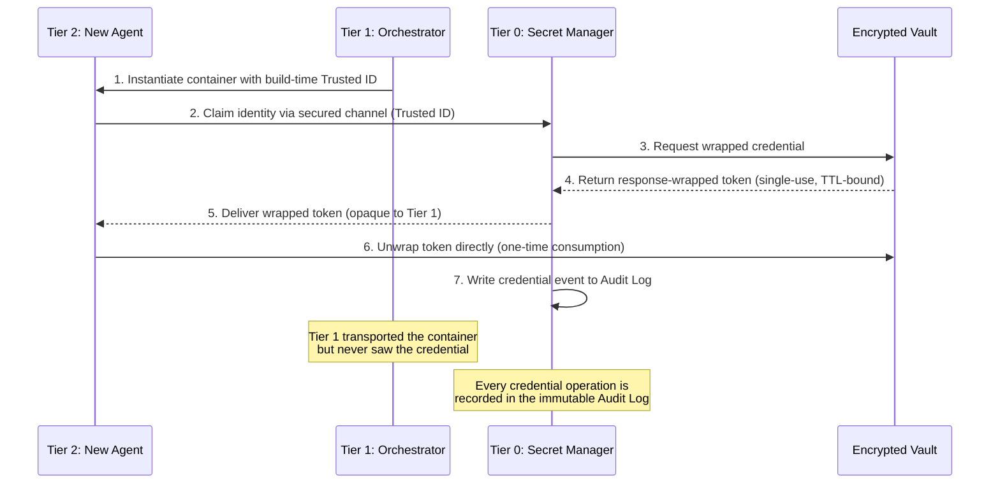
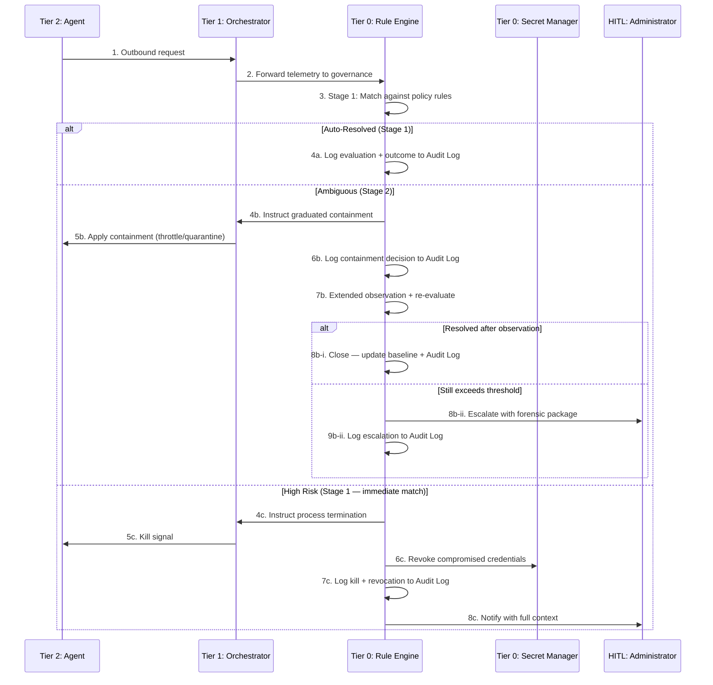

# Observer Layer Architecture (OLA)

**A Tiered Framework for Sovereign Identity and Sentinel Governance in Agentic Swarms**

---

### Abstract

The Observer Layer Architecture (OLA) introduces a mandatory third tier — the Sentinel Governance Layer — into the standard orchestrator-agent model. By structurally decoupling resource provisioning from identity management, OLA provides a double-blind privacy model that preserves data sovereignty even if the orchestrator is compromised. It replaces binary governance with a graduated pipeline, shifting from deterministic rule-based arbitration to Human-In-The-Loop (HITL) escalation only for ambiguous or high-impact anomalies. This paper details the architecture's design principles, trust models, cross-tier protocols, and reference pseudocode for high-privilege, trustless multi-agent environments.

---

### Chapter Overview

| # | Chapter | Focus |
|---|---------|-------|
| 1 | [Introduction](#1-introduction) | Problem statement and motivation for a third architectural tier |
| 2 | [Threat Model & Assumptions](#2-threat-model-and-assumptions) | Assumed threats, explicit trust boundaries, and out-of-scope risks |
| 3 | [Architectural Context](#3-architectural-context-from-2-tier-to-3-tier) | How OLA evolves the standard orchestrator–agent model |
| 4 | [Tier Overview](#4-the-three-tiers-of-ola) | Summary of all three tiers and their trust profiles |
| 5 | [The Observer Layer](#5-the-observer-layer-sentinel-governance) | Deep dive into Tier 0 — The Secret Manager and The Rule Engine |
| 6 | [The Service Layer](#6-the-service-layer-agent-swarm) | Tier 2 mapped to standard orchestrator and agent components |
| 7 | [Governance Model](#7-governance-model-automated-rule-based-to-human-in-the-loop) | Tiered governance: automated rules → rule engine arbitration → HITL escalation |
| 8 | [Cross-Tier Protocols](#8-cross-tier-interaction-protocols) | Double-blind secret delivery, anomaly response pipeline |
| 9 | [Design Principles](#9-core-design-principles) | Decoupling power from knowledge, deterministic substitution, resilient safe-fail |
| 10 | [Attack Walkthrough](#10-attack-scenario-walkthrough) | End-to-end trace of a compromised agent attempting exfiltration |
| 11 | [Sequence Diagram](#11-sequence-diagram) | End-to-end request flow across all three tiers |
| 12 | [Related Work](#12-related-work) | Comparison with Microsoft MARA and academic taxonomies |
| 13 | [Reference Pseudocode](#13-reference-pseudocode) | Framework-agnostic pseudocode for the three core mechanisms |
| 14 | [Glossary](#14-glossary) | Definitions of key OLA terminology |
| 15 | [Conclusion](#15-conclusion) | Summary and future directions |
| 16 | [References](#16-references) | Formal citations and academic context |

---

### 1. Introduction

#### The God-Process and the Limits of 2-Tier Models
Autonomous AI agents, capable of independent tool use and complex decision-making, are increasingly deployed in privileged host environments with access to sensitive user data. Industry reference architectures — most notably the **Microsoft Multi-Agent Reference Architecture (MARA)** — provide robust guidance for orchestrating such agents at scale, addressing concerns of modularity, agent registration, and communication patterns.

However, these architectures typically operate under a **2-tier trust model** in which a single orchestrator acts as a "God-process," holding both infrastructure control _and_ identity custody. If the orchestrator is compromised, the entire credential stack — and therefore all downstream agent identities — is exposed. Furthermore, governance in such systems often defaults to one of two extremes: either fully automated responses with no human oversight, or constant human approval that bottlenecks the system.

#### The Trust Calibration Problem
Relying heavily on human oversight or UI-level guardrails exposes a fundamental psychological vulnerability. Recent empirical research (He et al., 2025) demonstrates that users systematically over-trust LLM-generated plans that appear plausible but contain critical errors, with calibrated trust averaging significantly lower than expected. Agents that perform well under ideal conditions can inadvertently exploit human trust biases under adversarial ones. User involvement in plan review imposes high cognitive load while failing to reliably improve trust calibration, demonstrating that the "double-edged sword" of intelligent agents cannot be resolved merely through user-interface modifications.

#### The OLA Paradigm Shift
The **Observer Layer Architecture (OLA)** addresses these vulnerabilities by moving governance from UI-level trust calibration down to infrastructure-level isolation. OLA inserts a mandatory third tier above the orchestrator who controls the agent swarm: the **Sentinel Governance Layer**. This layer fundamentally **decouples resource provisioning (power) from identity management (knowledge)**, establishing a double-blind privacy model that preserves data sovereignty even in the event of an orchestrator compromise. Critically, it implements a **graduated governance pipeline** — automated rule-based decisions handle the majority of operational events, with Human-In-The-Loop (HITL) escalation reserved as the final authority for ambiguous or high-impact scenarios.

> This document describes the mechanisms of OLA at an abstract, framework-agnostic level. It is intended to complement — not replace — existing reference architectures by specifying the additional structural guarantees required for sovereign and trustless agent hosting.

---

### 2. Threat Model and Assumptions

Before detailing the architecture, it is necessary to explicitly define the threat model OLA is designed to defend against, what it explicitly trusts, and what falls outside its scope. Traditional agentic systems are increasingly exposed to new threat vectors, such as compromised Model Context Protocol (MCP) marketplaces, unvetted "skills," and tools that are instantiated faster than they can be manually audited.

#### 2.1 Attacker Capabilities

OLA assumes an adversary who can:

- **Compromise the Orchestrator:** Gain administrative control over the Orchestrator layer, with the ability to instantiate new containers, intercept network traffic routed through the orchestrator, and inspect container memory.
- **Inject Malicious Agents or Tools:** Leverage prompt injection, unvetted MCPs, or compromised external APIs to hijack an agent's reasoning loop.
- **Attempt Lateral Movement:** Exploit other internal components or exfiltrate plaintext credentials if exposed.

#### 2.2 Trust Assumptions

OLA explicitly trusts the following:

- **Operating System Capabilities:** The underlying OS/kernel correctly enforces process isolation, file permissions, and namespace boundaries (e.g., cgroups, Linux capabilities).
- **Cryptographic Primitives:** mTLS correctly hardens point-to-point network connections, and the underlying encryption algorithms cannot be trivially bypassed. Decoupled message queuing protocols efficiently and securely route telemetry to Tier 0 without tampering.
- **Root-of-Trust Bootstrap (Hardware Attestation vs. Build-Time IDs):** The mechanism the Tier 0 Secret Manager uses to identify a newly instantiated Tier 2 container. 
  - *Optimal:* **Hardware-Backed Cryptographic Attestation (TEE/TPM).** The physical hardware signs a cryptographic measurement (quote) proving the exact container binary running in isolated memory. Tier 0 verifies this signature before dispensing a credential. This prevents a compromised Tier 1 Orchestrator from extracting secrets by entirely excluding it from identity verification.
  - *Constrained environments:* **Build-Time Provenance.** Cryptographic hashes or build-time trusted IDs injected before container instantiation. While effective against external threats, this requires trusting that Tier 1 cannot intercept or forge these identities during instantiation.

#### 2.3 Out-of-Scope Threats

OLA is not designed to protect against:

- **Compromised Administrators:** A malicious human administrator with root access to offline keys or underlying physical infrastructure.
- **Malicious HITL Operators:** Operators actively subverting the governance escalation pipeline to approve unauthorized actions.
- **Hardware-Level Backdoors:** Firmware, chipset, or CPU-level (e.g., Intel ME) vulnerabilities that break OS memory isolation.
- **Supply Chain Attacks:** Vulnerabilities knowingly compiled into the core engine binaries before deployment.

---

### 3. Architectural Context: From 2-Tier to 3-Tier

#### The Standard 2-Tier Model

Traditional enterprise multi-agent systems rely on two logical tiers:

```
┌─────────────────────────────────────┐
│  ORCHESTRATOR LAYER                 │
│  • Agent lifecycle management       │
│  • Credential storage & distribution│
│  • Request routing & classification │
│  • State & memory management        │
│  • Governance: HITL or none         │
└────────────────┬────────────────────┘
                 │
┌────────────────▼────────────────────┐
│  AGENT SWARM LAYER                  │
│  • Specialized domain agents        │
│  • Tool invocation (MCP)            │
│  • Knowledge retrieval (RAG)        │
└─────────────────────────────────────┘
```

In this model, the Orchestrator acts as a **"God-process"**: it provisions containers, distributes secrets, classifies intents, and manages the full agent lifecycle. Governance decisions — when they exist — are either hardcoded into the orchestrator logic or escalated directly to a human operator, with no intermediate arbitration layer.

#### The OLA Paradigm Shift

OLA evolves the 2-tier model by extracting identity management, behavioral surveillance, and rule-based governance into an independent tier:

```
┌─────────────────────────────────────┐
│  TIER 0 — Sentinel Governance       │  ◄── NEW
│  • Secret Manager: identity & vault │
│  • Rule Engine: policy arbitration  │
│  • Audit Log: immutable trail       │
│  • Graduated governance pipeline    │
│  • HITL escalation (final step)     │
│  Trust: Knowledgeable but POWERLESS │
└────────────────┬────────────────────┘
                 │
┌────────────────▼────────────────────┐
│  TIER 1 — Orchestrator              │
│  • Hardware allocation              │
│  • Container instantiation          │
│  • Process lifecycle management     │
│  Trust: Privileged but BLINDED      │
└────────────────┬────────────────────┘
                 │
┌────────────────▼────────────────────┐
│  TIER 2 — Agent Swarm               │
│  • Task execution                   │
│  • Persona-driven interaction       │
│  • Multi-agent workflows            │
│  Trust: Restricted & CONTAINED      │
└─────────────────────────────────────┘
```

The critical insight is that **Tier 1 can build and destroy containers but never sees a plain-text secret**, while **Tier 0 can issue and revoke identities but cannot install software or modify the host**. Neither tier alone can both provision _and_ authenticate — a compromise of either tier in isolation does not yield full system control.

Equally important: Tier 0's **Rule Engine** operates deterministically rather than stochastically — governance decisions are resolved through codified policy rules, not probabilistic inference. This ensures predictable, auditable outcomes for the vast majority of operational events. Human-In-The-Loop intervention is invoked only when the Rule Engine encounters a scenario outside its policy boundaries — making HITL the final escalation step, not the default.

---

## 4. The Three Tiers of OLA

### Tier 0: Sentinel Governance Layer (The Observer)

- **Responsibility:** Identity bootstrapping, vault root custody, real-time behavioral surveillance, **policy-driven governance arbitration**, and **comprehensive audit logging** of all secret access, credential operations, and governance decisions.
- **Trust Profile:** **Knowledgeable but Powerless.** Tier 0 holds the cryptographic keys, monitors behavior, enforces governance policies, and maintains the system's immutable audit trail — but possesses no host-level installation or modification rights to avoid changes in audit files.
- **Governance Role:** Acts as the system's autonomous decision authority. The Rule Engine evaluates every security and operational event against codified policies before determining whether automated action is sufficient or HITL escalation is required. Every evaluation and every action is recorded in an append-only audit log.

### Tier 1: Host Orchestrator (Infrastructure & Power)

- **Responsibility:** Hardware resource allocation, container instantiation, and low-level process management.
- **Trust Profile:** **Privileged but Blinded.** Tier 1 manages the physical execution environment but has no cryptographic visibility into the secrets or personal data processed within the swarm.
- **Analogy:** The blind provisioner who builds the house but never receives the keys to the safe.

### Tier 2: Agent Swarm (Service & Execution)

- **Responsibility:** Task-specific execution, persona-driven interaction, and complex multi-agent workflows.
- **Trust Profile:** **Restricted & Contained.** Agents operate in individual sandboxes with mandatory egress proxies and persona-based tool mapping. They function as a managed swarm of intelligence, governed by Tier 0's policies and constrained by Tier 1's hardware quotas.

---

## 5. The Observer Layer: Sentinel Governance

The Sentinel Governance Layer (Tier 0) is the defining contribution of OLA. It houses three specialized functionalities: **Secret Management**, the **Governance Engine**, and the **Audit Log**. These components are logically isolated from each other and from the Host Orchestrator, following a Zero Trust approach in which no implicit trust is granted based on network location or component identity (NIST SP 800-207, 2020). All operations performed by any Tier 0 component are recorded in an immutable, append-only audit trail, ensuring full traceability and compliance with enterprise auditing standards (Microsoft Purview Audit, 2024; NIST SP 800-92, 2006).

### 5.0 Availability & Fault Tolerance

Because Tier 0 is the single authoritative governance layer, any downtime immediately halts credential issuance and policy arbitration. OLA requires Tier 0 to be deployed in a **High Availability (HA)** configuration. To prevent split-brain scenarios and ensure continuous operation, the stateful components of Tier 0 (the credential ledger and policy set) must be backed by a consensus-based datastore (e.g., Raft or Paxos). If Tier 0 becomes globally unreachable, the system must fail-closed: Tier 2 agents may complete existing operations within their credential TTLs, but no new credentials or HITL escalations can be processed until Tier 0 quorum is restored.

### 5.1 Secret Manager (Identity & Credential Custody)

A specialized governance service responsible for the custody and distribution of all cryptographic identities within the swarm. The Secret Manager is the sole entity authorized to interact with the system's encrypted secrets vault. The vault itself should implement AES-256 encryption at rest with RSA-4096 or Curve25519 asymmetric key pairs for transit encryption, following NIST SP 800-57 key management guidelines.

**How it works:** The Secret Manager receives identity-claim requests from newly instantiated Tier 2 agents, validates their provenance against build-time identifiers, and issues time-limited, single-use credentials via a response-wrapping protocol. At no point does the Orchestrator (Tier 1) observe the plain-text credential.

**Compromised Orchestrator Resilience:** If a malicious agent compromises the Orchestrator (Tier 1), the attacker gains the ability to instantiate containers and manage processes — but cannot extract secrets. The double-blind delivery mechanism ensures that credentials pass through the Orchestrator only as encrypted, opaque payloads. The Secret Manager (Tier 0) independently validates each identity claim against a build-time provenance record that the Orchestrator cannot forge. Even a fully compromised Tier 1 cannot mint valid identity claims, intercept unwrapped credentials, or modify the Secret Manager's validation logic — because Tier 0 operates on a separate trust boundary with immutable, read-only configuration.

#### Capabilities

| Capability | Mechanism |
|---|---|
| **Identity Bootstrapping** | Validates agent provenance against build-time trusted identifiers and issues wrapped credentials |
| **Double-Blind Delivery** | Implements response wrapping (cubbyhole pattern) — single-use, short-lived tokens delivered through encrypted channels |
| **Vault Root Custody** | Sole custodian of the unsealing mechanism for the encrypted secrets vault |
| **Credential Rotation** | Enforces automated rotation schedules; expired credentials are revoked without HITL involvement |
| **Collision Detection** | If a wrapped token is consumed before the legitimate claimant, the Secret Manager flags the event to the Rule Engine for immediate policy evaluation |
| **Access Audit Logging** | Every credential request, issuance, rotation, revocation, and failed claim attempt is recorded in the Tier 0 audit log with timestamp, requesting entity, and outcome |

#### Isolation Constraints & Enforcement Mechanisms

To guarantee that Tier 0 constraints are strictly enforced, OLA mandates enforcement at multiple levels:


- **Process and OS Level (Minimum Requirement):** The Secret Manager and Rule Engine must run with read-only root filesystems, dropped Linux capabilities (e.g., no `CAP_SYS_ADMIN`), and strict seccomp profiles that deny execution of arbitrary binaries. These cannot be overridden by Tier 1.
- **Hardware/Chipset Level (High Security Requirement):** For truly secure and multi-tenant applications, Tier 0 components should be isolated within hardware-backed Trusted Execution Environments (TEEs) such as Intel SGX or AMD SEV. This ensures memory cannot be probed or tampered with even by a root-level Orchestrator.
- **Immutable Identity (Soul Hardening):** Should an Agent instead of deterministic code be used: Core identity files for sensitive governance components are frozen at the OS level using read-only permissions and root-ownership. This prevents malicious modifications even if the host session experiences privilege escalation.
- **Knowledge Barrier:** The Secret Manager has no awareness of underlying infrastructure or administrative identity/tasks done by the orchestrator.
- **Resource Exhaustion Defense (Anti-DDoS):** To prevent a compromised Orchestrator from starving Tier 0 of compute resources (e.g., flooding it with fake identity claims or telemetry bursts), all ingest interfaces implement strict, source-agnostic rate limiting and circuit breakers, ensuring the core governance loops remain responsive under duress.

### 5.2 Rule Engine (Policy Arbitration & Behavioral Surveillance)

An autonomous governance service responsible for evaluating all security and operational events against a codified policy set. The Rule Engine determines the appropriate response — automated action, graduated throttling, or HITL escalation — for every event in the system.

To ensure Day-1 protection, the Rule Engine ships with a **default set of high-risk breach rules** (e.g., unauthorized cross-container network access, attempts to reach the secret vault without mTLS, bulk data movement). This guarantees that even before empirical baselining is complete, severe anomalies trigger autonomous containment or Lockbox workflows. Furthermore, continuous event logging captures these triggers, providing improved auditing and forensic capabilities even after a breach.

**How it works:** The Rule Engine continuously ingests telemetry (metrics, logs, network patterns) from all tiers and evaluates each signal against empirically established baselines and both default and custom-codified policy rules. For the majority of events, the engine resolves the appropriate action autonomously. Only events that fall outside the defined policy boundaries — or that exceed configurable risk thresholds — are escalated to a human operator.

#### Capabilities

| Capability | Mechanism |
|---|---|
| **Policy Evaluation** | Matches incoming events against a declarative rule set (condition → action mappings) to determine automated responses |
| **Baseline Correlation** | Cross-references resource metrics with system logs to contextualize anomalies (e.g., CPU spike + unusual auth attempt = elevated severity) |
| **Resource Fingerprinting** | Learns baseline consumption patterns per agent during a calibration phase; flags statistical deviations against configurable thresholds |
| **Honeytoken Validation** | Monitors canary credentials injected into configuration surfaces; any access triggers an immediate policy-defined response |
| **Network Quarantine** | Moves suspicious containers to an isolated network segment (no ingress/egress) for automated forensic capture or HITL review |
| **Graduated Throttling** | Applies incremental containment (CPU throttling, tarpit routing) for grey-zone anomalies before determining whether to escalate |
| **HITL Escalation** | Packages unresolved events with full forensic context (timeline, metrics snapshot, affected components) and routes to the human operator |
| **Decision Audit Logging** | Every policy evaluation, automated action, containment decision, and HITL escalation is recorded in the Tier 0 audit log with full decision context |

#### Policy Resolution Order

The Rule Engine processes events through a strict resolution hierarchy:

1. **Auto-Resolve:** Event matches a known-benign pattern or falls within baseline thresholds → no action.
2. **Auto-Mitigate:** Event matches a codified threat pattern with a defined automated response → execute mitigation (throttle, quarantine, kill).
3. **Defer & Observe:** Event is ambiguous; does not match known patterns → apply temporary containment, extend observation window, re-evaluate.
4. **Hierarchical HITL Escalation (L1 Triage):** Event exceeds risk thresholds. To prevent **Alert Fatigue** (where an operator is overwhelmed by thousands of low-signal approvals and defaults to blind trust), escalation is managed by an L1 Triage Model. Operators can deploy context-aware deterministic whitelisting (approving a specific context once, causing identical future events to auto-resolve). *Future extensions may utilize specialized Machine Learning classifiers trained on past HITL decisions to suggest or automatically resolve low-risk ambiguities. Therefore, a strict impact classification of approval requests is necessary. Critically, to preserve Tier 0's deterministic guarantee, any such ML model acts strictly as an advisory system—it is never granted autonomous authority to issue kill signals or revoke credentials. (High impact)* The human operator remains the final authority.

#### Isolation Constraints

- **Read-only host access.** The Rule Engine can read system logs and metrics but cannot write to the host filesystem.
- **Scoped control.** Process control is limited to container-level signals (stop, kill, network disconnect). The engine cannot modify container images or configurations.
- **Policy immutability at runtime.** Policy rules can only be modified by the human operator through an authenticated, out-of-band channel. The Rule Engine cannot alter its own rule set.

### 5.3 Audit Log (Immutable Observability Trail)

A centralized, append-only logging service that records every operation performed within Tier 0. The Audit Log is the system's authoritative record of all secret access, credential lifecycle events, policy evaluations, governance decisions, and HITL interactions. It follows the recommendations of **Microsoft Purview Audit** for unified audit logging across security-critical operations (Microsoft Purview Compliance, 2024), and aligns with **NIST SP 800-92** (Guide to Computer Security Log Management) for log integrity, retention, and analysis.

**How it works:** Every Tier 0 component writes structured audit entries to the log before completing its operation. The log is append-only and cryptographically chained — each entry includes a hash of the previous entry, forming a tamper-evident chain that can be independently verified. The Audit Log cannot be modified, truncated, or deleted by any runtime component, including the Rule Engine and Secret Manager.

#### Audit Entry Schema

Each audit entry contains:

| Field | Content |
|---|---|
| **Entry ID** | Monotonically increasing identifier |
| **Timestamp** | UTC timestamp with millisecond precision |
| **Source Component** | Originating Tier 0 component (Secret Manager / Rule Engine / HITL) |
| **Operation Type** | Category of operation (credential_issue, credential_revoke, policy_evaluate, policy_mitigate, hitl_escalate, hitl_decision, etc.) |
| **Subject** | The entity or resource acted upon (agent ID, container ID, policy rule ID) |
| **Outcome** | Result of the operation (success, denied, escalated, expired) |
| **Context Hash** | Hash of the associated telemetry or request payload for forensic correlation |
| **Chain Hash** | SHA-256 hash of the previous audit entry, ensuring tamper evidence |

#### What Gets Logged

- **All secret access:** Every credential request, issuance, unwrapping, rotation, and revocation
- **All policy evaluations:** Every event processed by the Rule Engine, including auto-resolved events, with the matched rule and resulting action
- **All containment actions:** Every throttle, quarantine, kill signal, and network isolation, with the triggering event and decision rationale
- **All HITL interactions:** Every escalation package sent, every human decision received, and every policy update codified from HITL feedback
- **All authentication events:** Every identity claim, validation result, and collision detection across the system

#### Isolation Constraints

- **Append-only enforcement.** The Audit Log accepts only write-append operations. No component — including the human operator — can delete or modify existing entries at runtime.
- **Independent storage.** The audit log is stored on a dedicated, isolated volume separate from application data. This ensures that a compromise of application storage does not affect audit integrity.
- **Tamper evidence.** The cryptographic chain hash allows an external auditor to verify that no entries have been inserted, modified, or removed after the fact.
- **Retention policy.** Audit entries are retained for a configurable minimum period (recommended: 90 days for operational logs, 1 year for credential events) following Microsoft Purview Audit retention guidelines.

---

## 6. The Service Layer: Agent Swarm

Tier 2 maps directly to the standard **Orchestrated Agent Swarm** pattern defined in architectures such as Microsoft MARA, where MARA spans Tier 1 (Orchestration) and Tier 2 (Execution). This is the operational environment where user-facing task execution occurs.

OLA deliberately does not prescribe specific agent topologies, memory structures, or routing mechanisms for Tier 2. Whether the swarm employs a single monolithic orchestrator agent, a hierarchical registry, or a decentralized network of specialized domain actors is orthogonal to the governance model.

The only mandatory architectural constraint OLA imposes on Tier 2 is **Direct Authentication:** Agents must be capable of establishing an out-of-band, cryptographically secured channel (e.g., mTLS) directly to Tier 0 to request their initial operational credentials, bypassing Tier 1 entirely. Once initialized, the swarm operates exactly as it would in a standard 2-tier model, with all external interactions governed by Tier 0's behavioral surveillance.

---

## 7. Governance Model: Automated Rule-Based to Human-In-The-Loop

The governance model is the operational heart of the Observer Layer. Traditional multi-agent architectures typically implement governance as either fully automated (agent-level guardrails) or fully manual (human approval queues). OLA introduces a **graduated governance pipeline** in which automated, rule-based arbitration handles the majority of decisions, and HITL serves as the final escalation authority.

### 7.1 The Governance Pipeline

```
┌───────────────────────────────────────────────────────────┐
│                   EVENT INGESTION                         │
│  Telemetry from all tiers: metrics, logs, network, vault  │
│  ► All ingested events written to Audit Log               │
└──────────────────────┬────────────────────────────────────┘
                       │
                       ▼
┌───────────────────────────────────────────────────────────┐
│  STAGE 1: Automated Policy Match                          │
│  • Pattern matching against codified rules                │
│  • Baseline threshold comparison                          │
│  • Known-benign / known-threat classification             │
│                                                           │
│  Outcome: ~80% of events resolved here                    │
│  Actions: Auto-resolve, auto-mitigate                     │
│  ► Every evaluation + action written to Audit Log         │
└──────────────────────┬────────────────────────────────────┘
                       │ Unmatched / ambiguous
                       ▼
┌───────────────────────────────────────────────────────────┐
│  STAGE 2: Rule Engine Arbitration                         │
│  • Multi-signal correlation (metrics + logs + context)    │
│  • Graduated containment (throttle, tarpit, quarantine)   │
│  • Extended observation window with re-evaluation         │
│                                                           │
│  Outcome: ~15% of events resolved here                    │
│  Actions: Temporary containment, forensic capture         │
│  ► All containment decisions written to Audit Log         │
└──────────────────────┬────────────────────────────────────┘
                       │ Exceeds risk threshold / policy gap
                       ▼
┌───────────────────────────────────────────────────────────┐
│  STAGE 3: Human-In-The-Loop Escalation                    │
│  • Fully packaged forensic context delivered              │
│  • Timeline, metrics snapshot, affected components        │
│  • Recommended action from Rule Engine (advisory)         │
│  • Human operator makes final binding decision            │
│                                                           │
│  Outcome: ~5% of events reach this stage                  │
│  Actions: Approve/deny/modify recommended action          │
│  ► Escalation + human decision written to Audit Log       │
└───────────────────────────────────────────────────────────┘
```

### 7.2 Why HITL Is the Final Step, Not the Default

In 2-tier architectures, governance often collapses into one of two failure modes:

| Failure Mode | Problem |
|---|---|
| **Over-Automation** | All decisions are automated. Novel attack patterns or edge cases are handled by rules that were never designed for them, leading to false negatives or disproportionate responses. |
| **Over-Escalation** | All ambiguous events are escalated to a human operator. The operator is overwhelmed with low-signal alerts, leading to alert fatigue and missed critical events. |

OLA's graduated pipeline avoids both extremes:

- **Stage 1** eliminates noise: known patterns are resolved instantly without human involvement.
- **Stage 2** provides a buffer: ambiguous signals are contained and observed before any irreversible action or escalation occurs.
- **Stage 3** preserves human authority: the operator is only engaged for events that genuinely require judgment, and they receive pre-correlated forensic context rather than raw telemetry.

### 7.3 HITL Escalation Interface

When an event reaches Stage 3, the Rule Engine constructs an **Escalation Package** containing:

| Field | Content |
|---|---|
| **Event ID** | Unique identifier for traceability |
| **Severity Classification** | Rule Engine's assessed severity (High / Critical / Unknown) |
| **Timeline** | Chronological sequence of correlated signals leading to escalation |
| **Affected Components** | List of tiers, containers, and services impacted |
| **Containment Status** | Current temporary containment actions already applied |
| **Recommended Action** | Rule Engine's advisory recommendation (e.g., "kill and lockbox," "extend observation," "whitelist") |
| **Policy Gap Flag** | Indicates if the event exposed a gap in the existing rule set that should be addressed |

The human operator reviews the package and issues a **binding decision**. If the decision involves a new policy pattern, the operator can optionally codify it as a new rule through the authenticated policy update channel, reducing future HITL escalations for similar events.

### 7.4 Governance Feedback Loop



This feedback loop ensures the system becomes progressively more autonomous over time: each HITL decision that reveals a new pattern can be codified as a rule, shifting future similar events from Stage 3 to Stage 1 or Stage 2.

---

## 8. Cross-Tier Interaction Protocols

### 8.0 Network Isolation (Dual-Bus Topology)

Before detailing the algorithmic protocols, it is critical to observe the physical network constraints. OLA enforces a tiered privilege model via isolated network segments (e.g., a high-security management zone with no internet access for Tier 0, and a restricted operational zone for Tier 1 and Tier 2). 

A key infrastructural realization of this isolation is the **Dual Message Bus topology**. Rather than relying on virtual isolation (such as RabbitMQ vHosts) on a shared message broker, OLA mandates **complete physical or container-level separation** of the messaging networks based on their purpose:
1. **The Governance Broker (Tier 0 ↔ Tier 1 & 2):** A dedicated, highly secure message broker (e.g., an entirely separate RabbitMQ Docker stack) that handles all telemetry from Tier 1 to Tier 0, and all containment signals from Tier 0 to Tier 1. It also handles direct identity claims from Tier 2 to Tier 0.
2. **The Operational Broker (Tier 1 ↔ Tier 2):** A completely distinct, unprivileged message broker network utilized for swarm execution (e.g., task queuing, tool use, LLM requests).

Crucially, **Tier 0 remains strictly isolated on the Governance network**. It is **Tier 1 (The Orchestrator)** that must connect to both networks — routing its telemetry up to Tier 0 securely, while managing the agents down on the Operational Broker. Tier 1 never blindly forwards packets between the two buses.

### 8.1 Double-Blind Secret Delivery

The mechanism that ensures the Orchestrator (Tier 1) never observes plain-text credentials, even though it physically instantiates and orchestrates the transport channel.



**Properties:**

- The wrapping token is single-use and expires after a short TTL.
- Tier 1 transports the encrypted payload but cannot decrypt it.
- **Direct Channel Authentication (mTLS):** The direct connection between Tier 2 and Tier 0 relies on pre-provisioned mTLS certificates baked into the container image at build time (or strictly enforced kernel-level network namespaces), ensuring the Orchestrator cannot MITM the authentication channel.
- If the token is intercepted and consumed before the legitimate agent, the Secret Manager detects the collision and triggers a high-risk event in the Rule Engine.

### 8.2 Anomaly Detection and Governance Response

The mechanism by which the Rule Engine detects, classifies, and responds to behavioral anomalies — including the HITL escalation path.



### 8.3 Emergency Protocols: The Lockbox and the Dead Man's Switch

A resilient safe-fail mechanism replaces standard binary "delete-on-breach" triggers with a recovery-oriented encryption and restoration protocol.

**The Dead Man's Switch Engine:** Upon confirmed high-risk breach detection — whether triggered autonomously by the Rule Engine, authorized by the human operator, or engaged via loss of a periodic external heartbeat — the system:

1. **Terminates** all compromised Tier 2 processes (SIGKILL).
2. **Archives** all associated container volumes, memory, and runtime state.
3. **Encrypts** the archived data using the administrator's offline public key (asymmetric encryption) and systematically shreds the original plaintext state.
4. **Seals** the result as a "Lockbox" — a self-contained, encrypted forensic package.

The Lockbox preserves data sovereignty: the encrypted archive can only be opened by the administrator's private key, which is never stored on the system. This ensures that forensic evidence is preserved for post-incident analysis while preventing exfiltration by an attacker who has gained active persistence in the environment.

**The Disaster Recovery Engine:** To reverse the locked state, an authorized administrator provides an offline private key out-of-band to decrypt the Lockbox. The recovery protocol systematically decrypts states and restarts services in strict dependency order, rigorously prioritizing the root of trust (Tier 0) before re-instantiating the Orchestrator (Tier 1) and authorizing the Agent Swarm (Tier 2). Currently, Lockbox engagement represents a full halt to the compromised workflow. Future iterations of OLA will explore **Stateful Agent Rollbacks**, enabling the recovery engine to use deterministic memory snapshots to rewind an agent to its last known good state prior to the anomaly, preserving partial task progress.

---

## 9. Core Design Principles

The following principles guide the structural decisions of OLA. They extend the standard multi-agent design principles (Separation of Concerns, Secure by Design, Failure Isolation) with constraints specific to sovereign and trustless hosting:

| Principle | Description |
|---|---|
| **Decoupling Power from Knowledge** | The Orchestrator (power to run) and the Observer (knowledge to identify) are architecturally separated. Administrative access to infrastructure does not grant access to user-protected data. |
| **Infrastructural Distrust** | Security is enforced by environmental constraints, not by assuming agent or orchestrator trustworthiness, or trying to safeguard the tools and MCP marketplace used by the agents. Every component is treated as potentially compromised. |
| **Double-Blind Sovereignty** | No single tier holds both the capability to provision resources _and_ the capability to read secrets. A compromise of any individual tier does not yield full system control. |
| **Graduated Governance** | Governance decisions follow a strict pipeline from automated resolution through rule-based arbitration to HITL escalation. Human authority is preserved but only invoked when automated mechanisms are insufficient. |
| **Comprehensive Auditability** | Every secret access, policy evaluation, governance decision, and HITL interaction is recorded in an immutable, append-only audit log with cryptographic chaining. No operation within Tier 0 is permitted without a corresponding audit entry (Microsoft Purview Audit, 2024; NIST SP 800-92). |
| **Deterministic Substitution** | Procedural logic is offloaded from stochastic LLM processes to deterministic, containerized workers. This reduces cost, eliminates non-determinism in critical paths, and improves auditability. |
| **Resilient Safe-Fail** | Breach response prioritizes data preservation over data destruction. The Lockbox protocol ensures forensic recoverability without enabling exfiltration. |
| **Empirical Baselining** | Resource and behavioral thresholds are derived from measured calibration periods, not static assumptions. To prevent massive false positives on Day 1, containers enter an initial "Learning Mode" where anomalies are audited but do not trigger autonomous containment until statistical confidence is established. |
| **Progressive Autonomy** | The governance feedback loop enables the system to learn from HITL decisions by codifying new rules, progressively reducing the need for human escalation over time. |

---

## 10. Attack Scenario Walkthrough

To demonstrate how the three tiers and the graduated governance pipeline interact under duress, consider a scenario where an adversary leverages prompt injection to compromise a Tier 2 agent.

**The Setup:** An adversary injects a malicious prompt into an external data source pulled by an agent via RAG. The agent's reasoning loop is hijacked, and it attempts to exfiltrate the user's encrypted data to an unauthorized endpoint.

1. **The Action:** The compromised agent initiates an outbound HTTP POST request to `evil-server.com`.
2. **Tier 1 (Infrastructure) Routing:** The Orchestrator intercepts the outbound proxy request. It does not know if the request is benign or malicious, but it forwards the network telemetry to the Rule Engine (Tier 0).
3. **Tier 0 (Governance) Stage 1 Evaluation:** The Rule Engine evaluates the telemetry. It checks the destination against the `unknown_network_egress` policy constraint. Because `evil-server.com` is not in the approved domain list, the Rule Engine triggers an immediate Stage 2 response.
4. **Tier 1 Enforcement:** The Rule Engine instructs the Orchestrator to apply immediate CPU throttling and network tarpitting (reducing bandwidth to 1kbps) to limit exfiltration speed while gathering more data. It writes this action to the Audit Log.
5. **Tier 0 Stage 2 Correlation:** Observing the container over the next 30 seconds, the Rule Engine correlates the `unknown_network_egress` with a sudden spike in file read operations on sensitive local memory. The combined risk score exceeds the escalation threshold.
6. **Tier 0 Escalation & Lockbox:** Because the risk score denotes a critical threat, the Rule Engine triggers the default High-Risk Breach policies:
    - It sends a SIGKILL to the Orchestrator to terminate the container.
    - It triggers the Lockbox Protocol, encrypting the container's final memory state with the Administrator's public key.
    - It revokes the agent's credentials via the Secret Manager.
    - It packages all forensic telemetry and escalates to the HITL operator for review.

Even with full control of the agent's reasoning loop, the attacker is contained by Tier 0's autonomous constraints before any meaningful data can be exfiltrated.

---

## 11. Sequence Diagram

End-to-end request flow across all three tiers, from user input to response delivery:

```mermaid
sequenceDiagram
    participant User
    participant T2 as Tier 2: Agent Swarm
    participant T1 as Tier 1: Orchestrator
    participant RE as Tier 0: Rule Engine
    participant SM as Tier 0: Secret Manager
    participant Ext as External Service

    User->>T2: 1. Submit request
    T2->>T2: 2. Resolve persona context & plan task

    T2->>T1: 3. Outbound tool/service request
    T1->>RE: 4. Forward request telemetry to governance
    RE->>RE: 5. Evaluate against policy rules
    RE-->>T1: 6. Approve / deny / escalate
    T1->>Ext: 7. Proxy approved request (mTLS)
    Ext-->>T1: 8. Return response
    T1-->>T2: 9. Deliver filtered response

    T2->>T2: 10. Synthesize final answer
    T2-->>User: 11. Return response

    RE->>RE: 12. Log request evaluation to Audit Log

    Note over RE: Rule Engine continuously evaluates<br/>all telemetry; escalates to HITL only<br/>when policy boundaries are exceeded
    Note over T1: Orchestrator provides compute and<br/>routing but observes no secrets
    Note over RE: Every governance decision is recorded<br/>in the immutable Tier 0 Audit Log
```

---

## 12. Related Work

### 12.1 Microsoft Multi-Agent Reference Architecture (MARA)

Microsoft's MARA provides comprehensive guidance for building scalable multi-agent systems within cloud ecosystems, covering orchestration, agent registration, communication patterns, memory management, observability, and security. MARA's security documentation explicitly recommends that "every orchestration and agent call is logged with metadata: timestamp, caller identity, input hash, output hash" and that "logs are shipped to centralized observability platform" (MARA Security, 2025). OLA builds upon MARA's structural foundations — particularly the principles of Separation of Concerns, Secure by Design, Failure Isolation, and Auditability — while introducing four key extensions:

1. **Structural Distrust:** MARA's security model focuses on authentication, authorization, and policy enforcement. OLA adds an architectural guarantee: even with valid credentials, no single component can both provision resources and access secrets.
2. **Observer Tier:** MARA's Orchestrator combines coordination with credential management. OLA extracts identity custody into an independent tier with a dedicated Secret Manager that is architecturally blinded from infrastructure control.
3. **Graduated Governance:** MARA supports standard rollback, versioning, and manual override mechanisms. OLA introduces a formalized governance pipeline that bridges the gap between fully automated guardrails and fully manual oversight, with the Rule Engine providing autonomous arbitration and HITL reserved as the final escalation step.
4. **Immutable Audit Trail:** MARA recommends centralized logging and audit metadata. OLA enforces this structurally by placing the audit log within Tier 0 as an append-only, cryptographically chained record that cannot be modified by the Orchestrator or the Agent Swarm — ensuring that the governance layer's own decisions are independently verifiable.

### 12.2 NIST AI 100-2 and SP 800-190

OLA adheres to NIST SP 800-190 (Application Container Security Guide) for container-level isolation and resource enforcement. The tiered trust model extends the NIST AI 100-2 framework for adversarial machine learning by addressing infrastructure-level attack vectors beyond the model layer.

### 12.3 Plan-Then-Execute (He et al., 2025)

Empirical research by He et al. (CHI 2025) establishes that LLM agents operating in a plan-then-execute paradigm present a "double-edged sword": users systematically over-trust plausible yet flawed plans. OLA extends this work from single-agent UI patterns to multi-agent infrastructure enforcement. Where He et al. observe the limits of user trust calibration at the interface level, OLA replaces UI-level trust with architectural isolation. Furthermore, the architecture codifies their recommendation for "context-dependent involvement" not merely as a UI toggle, but as an infrastructure-level policy engine with automatic risk-based escalation (e.g., auto-approve, alert, mandatory human-in-the-loop).

### 12.4 Security-Usability Trade-offs and Opt-In Cryptographic Proofs

A common extension in high-security architectures is the generation of External Cryptographic Attestations (e.g., Zero-Knowledge Receipts) to prove to end-users that an agent's response was governed securely and not tampered with. However, OLA mandates that such mechanisms remain strictly **opt-in**.

Academic literature on the "security-usability trade-off" consistently demonstrates that users systematically prioritize simplicity and convenience over strict security overhead. As Kirlappos et al. and other researchers note, imposing complex verification steps (like managing cryptographic receipts or hardware tokens) creates friction that reduces overall task efficiency and user adoption—often paradoxically leading to users bypassing the security entirely. Because OLA provides structural, internal guarantees via the Audit Log and double-blind isolation, shifting the verification burden to the end-user via mandatory external proofs introduces unnecessary usability overhead. Therefore, consumer-facing cryptographic attestations should be reserved as an optional toggle for highly sensitive enterprise configurations, while the default user experience remains frictionless. However, for environments demanding rigorous external verification (External Zero Trust), Tier 0 can optionally generate Remote Attestation Quotes verifiable by an independent audit server, providing mathematically provable architectural integrity to external clients without burdening the end-user.

### 12.5 arc42 Architecture Standard

The architectural documentation and framework modeling of OLA adhere to the principles of the arc42 structural template, utilizing formal separation of concepts.

---

## 13. Reference Pseudocode

The following pseudocode illustrates the three core mechanisms of OLA at a framework-agnostic level. These examples are intended to clarify the operational logic described in preceding chapters — not to prescribe a specific implementation.

### 13.1 Policy Language Example

To make the deterministic rules concrete, the Rule Engine evaluates telemetry against declarative schemas. A rule mitigating a compromised agent attempting exfiltration might look like:

```yaml
rule "unknown_network_egress" {
    condition: egress_connection == ESTABLISHED AND destination NOT IN $approved_ips
    classification: SUSPICIOUS
    action: LOWER_CPU_AND_OBSERVE
    severity: HIGH
}

rule "high_cpu_with_vault_access" {
    condition: cpu_usage > baseline * 2.0 AND secret_vault_attempts > 3 within 60s
    classification: THREAT
    action: ENCRYPT_AND_KILL
    severity: CRITICAL
}
```

### 13.2 Double-Blind Secret Delivery

The cubbyhole response-wrapping protocol that ensures the Orchestrator (Tier 1) never observes plain-text credentials.

```pseudocode
// TIER 1: Orchestrator instantiates a new agent container
function orchestrator_instantiate_agent(agent_spec):
    trusted_id = generate_build_time_id(agent_spec)
    container  = create_container(agent_spec, trusted_id)
    // Orchestrator knows the trusted_id but NOT the credential
    // that will be issued to the agent
    start_container(container)
    return container


// TIER 2: New agent claims its identity
function agent_claim_identity(trusted_id):
    // Agent contacts Secret Manager directly (not via Orchestrator)
    claim_request = {
        trusted_id:    trusted_id,
        timestamp:     now_utc(),
        nonce:         generate_random_nonce()
    }
    wrapped_token = secret_manager.request_credential(claim_request)
    // Agent unwraps the token directly against the Vault
    credential = vault.unwrap(wrapped_token)   // one-time consumption
    return credential


// TIER 0: Secret Manager validates and issues credentials
function secret_manager.request_credential(claim_request):
    // Step 1: Validate provenance
    if not provenance_registry.contains(claim_request.trusted_id):
        audit_log.append("credential_denied", claim_request, "unknown_id")
        raise IdentityClaimRejected

    // Step 2: Check for collision (token already consumed)
    if token_ledger.is_already_claimed(claim_request.trusted_id):
        audit_log.append("collision_detected", claim_request, "critical")
        rule_engine.ingest_event(COLLISION_EVENT, claim_request)
        raise CredentialCollisionDetected

    // Step 3: Request wrapped token from Vault
    wrapped_token = vault.wrap_credential(
        identity:   claim_request.trusted_id,
        ttl:        30_seconds,       // short-lived
        max_uses:   1                  // single-use
    )

    // Step 4: Record in audit log BEFORE returning
    audit_log.append("credential_issued", claim_request, "success")
    token_ledger.mark_issued(claim_request.trusted_id)

    return wrapped_token
    // NOTE: The Orchestrator (Tier 1) never sees wrapped_token.
    // It passes through a direct Tier 2 <-> Tier 0 channel.
```

### 13.3 Rule Engine Policy Evaluation

The deterministic 4-stage resolution logic that processes every telemetry event.

```pseudocode
// TIER 0: Rule Engine main evaluation loop
function rule_engine.evaluate(event):
    // Every event is logged on ingestion, regardless of outcome
    audit_log.append("policy_evaluate_start", event, "ingested")

    // ── STAGE 1: Automated Policy Match ──
    matched_rule = policy_set.match(event)

    if matched_rule exists AND matched_rule.confidence == HIGH:
        if matched_rule.classification == BENIGN:
            // Auto-resolve: known safe pattern
            audit_log.append("policy_evaluate", event, "auto_resolved",
                             rule_id: matched_rule.id)
            return RESOLVED

        if matched_rule.classification == THREAT:
            // Auto-mitigate: known threat with defined response
            execute_mitigation(matched_rule.action, event)
            audit_log.append("policy_mitigate", event, "auto_mitigated",
                             rule_id: matched_rule.id,
                             action:  matched_rule.action)
            if matched_rule.severity >= CRITICAL:
                notify_administrator(event, matched_rule)
            return MITIGATED

    // ── STAGE 2: Rule Engine Arbitration (ambiguous events) ──
    correlated = correlate_signals(event, telemetry_window: 5_minutes)
    risk_score = calculate_risk(correlated)

    if risk_score < ESCALATION_THRESHOLD:
        // Apply graduated containment and observe
        containment = apply_containment(event, level: risk_score)
        audit_log.append("containment_applied", event, containment.type,
                         risk_score: risk_score)

        // Extended observation window
        wait(observation_window: 60_seconds)
        updated_signals = correlate_signals(event, telemetry_window: 5_minutes)
        updated_risk    = calculate_risk(updated_signals)

        if updated_risk < ESCALATION_THRESHOLD:
            release_containment(containment)
            update_baseline(event, updated_signals)
            audit_log.append("containment_released", event, "resolved")
            return RESOLVED
        else:
            risk_score = updated_risk  // fall through to Stage 3

    // ── STAGE 3: HITL Escalation ──
    escalation_package = build_escalation_package(
        event_id:            event.id,
        severity:            classify_severity(risk_score),
        timeline:            correlated.timeline,
        affected_components: correlated.components,
        containment_status:  get_active_containments(event),
        recommended_action:  suggest_action(risk_score, correlated),
        policy_gap_flag:     (matched_rule == null)
    )

    audit_log.append("hitl_escalated", event, "awaiting_human",
                     package_id: escalation_package.id)
    send_to_administrator(escalation_package)
    return ESCALATED


// ── STAGE 4: Process HITL Decision (callback) ──
function rule_engine.process_hitl_decision(decision):
    execute_action(decision.action)
    audit_log.append("hitl_decision", decision, decision.action)

    // Governance feedback loop: codify new rule if applicable
    if decision.codify_as_rule:
        new_rule = policy_set.add_rule(
            pattern:        decision.event_pattern,
            classification: decision.classification,
            action:         decision.action,
            author:         decision.operator_id,
            source:         "hitl_feedback"
        )
        audit_log.append("rule_codified", new_rule, "policy_updated")
```

### 13.4 Audit Log Chain

The cryptographic hash chain that ensures tamper evidence for all governance operations.

```pseudocode
// TIER 0: Audit Log — append-only, cryptographically chained

state:
    entries      = []              // ordered list of audit entries
    last_hash    = SHA256("GENESIS")  // genesis block hash
    next_id      = 1


function audit_log.append(operation_type, subject, outcome, **context):
    entry = {
        entry_id:         next_id,
        timestamp:        now_utc(),                 // millisecond precision
        source_component: get_caller_component(),    // Secret Manager | Rule Engine | HITL
        operation_type:   operation_type,
        subject:          serialize(subject),
        outcome:          outcome,
        context_hash:     SHA256(serialize(context)), // hash of the full context
        chain_hash:       SHA256(last_hash + serialize(entry_without_chain_hash))
    }

    // Write to append-only storage (no update/delete permitted)
    persistent_store.append(entry)

    // Update chain state
    last_hash = entry.chain_hash
    next_id   = next_id + 1

    return entry.entry_id


// EXTERNAL: Verify chain integrity (run by auditor)
function verify_audit_chain(entries):
    expected_hash = SHA256("GENESIS")

    for each entry in entries:
        // Recompute the chain hash from the previous entry
        computed_hash = SHA256(
            expected_hash + serialize(entry_without_chain_hash)
        )

        if computed_hash != entry.chain_hash:
            return TAMPERED_AT(entry.entry_id)

        expected_hash = entry.chain_hash

    return CHAIN_VALID


// EXTERNAL: Verify a specific entry was not retroactively inserted
function verify_entry_integrity(entry, previous_entry, next_entry):
    // Check backward link
    expected_chain = SHA256(
        previous_entry.chain_hash + serialize(entry_without_chain_hash)
    )
    if expected_chain != entry.chain_hash:
        return BACKWARD_LINK_BROKEN

    // Check forward link
    expected_next = SHA256(
        entry.chain_hash + serialize(next_entry_without_chain_hash)
    )
    if expected_next != next_entry.chain_hash:
        return FORWARD_LINK_BROKEN

    return ENTRY_VALID
```

---

## 14. Glossary

- **Double-Blind Sovereignty:** The principle that no tier holds both provisioning power and credential visibility.
- **HITL (Human-In-The-Loop):** The ultimate escalation authority, reserved for high-impact decisions following Rule Engine arbitration.
- **Lockbox Protocol:** A safe-fail response that encrypts an agent's runtime state with an offline public key for forensic review.
- **Rule Engine:** The autonomous arbiter in Tier 0 that executes deterministic governance against codified policies.
- **Secret Manager:** The Tier 0 component that holds the vault sealing keys and validates identity provenance.

---

## 15. Conclusion

The Observer Layer Architecture extends the established 2-tier orchestrator–agent model with a mandatory Sentinel Governance Layer that decouples resource provisioning from identity management. By distributing trust across three architecturally isolated tiers — each with complementary capabilities and complementary blindnesses — OLA provides structural guarantees against credential exposure, unauthorized exfiltration, and catastrophic single-point-of-failure scenarios.

The graduated governance model ensures that the system is neither fully dependent on human oversight nor fully autonomous in its decision-making. The Rule Engine resolves the majority of operational and security events through codified policies, while HITL escalation preserves human authority for the scenarios that genuinely require it. Over time, the governance feedback loop enables progressive autonomy: each human decision that reveals a new pattern can be codified as a rule, reducing the HITL surface area while maintaining the integrity of the governance pipeline.

Critically, every operation within the governance layer — every secret access, policy evaluation, containment decision, and HITL interaction — is recorded in an immutable, cryptographically chained audit log. This ensures that the system's own governance decisions are independently verifiable and that no security-critical action can occur without a traceable record.

The architecture is framework-agnostic and designed to wrap existing agentic engines. Its core mechanisms — double-blind secret delivery, rule-based governance with HITL escalation, immutable audit logging, and the Lockbox safe-fail protocol — are applicable to any multi-agent system that operates in a high-privilege, trustless environment.

---

## 16. References

1. NIST SP 800-207, "Zero Trust Architecture," August 2020.
2. NIST SP 800-190, "Application Container Security Guide," September 2017.
3. NIST SP 800-92, "Guide to Computer Security Log Management," September 2006.
4. NIST SP 800-57, "Recommendation for Key Management," May 2020.
5. Microsoft, "Multi-Agent Reference Architecture (MARA)," 2025.
6. Microsoft Purview Compliance, "Microsoft Purview Audit," 2024.
7. He, G., Demartini, G., & Gadiraju, U. (2025). "Plan-Then-Execute: An Empirical Study of User Trust and Team Performance When Using LLM Agents As A Daily Assistant." CHI 2025. https://arxiv.org/abs/2502.01390

---

**Copyright © 2026 Andreas Greger**

This work is licensed under the [Creative Commons Attribution-ShareAlike 4.0 International License](https://creativecommons.org/licenses/by-sa/4.0/) (CC BY-SA 4.0).

You are free to share and adapt this material for any purpose, including commercial, under the following terms:

- **Attribution** — You must give appropriate credit, provide a link to the license, and indicate if changes were made.
- **ShareAlike** — If you remix, transform, or build upon this material, you must distribute your contributions under the same license.
